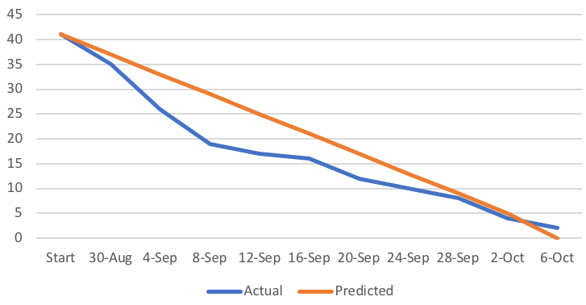
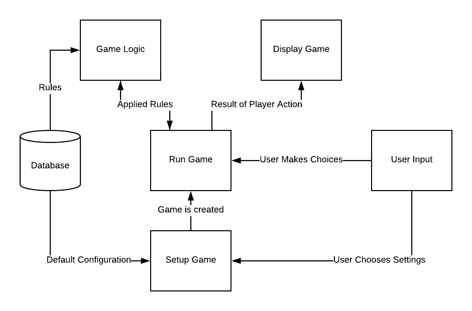
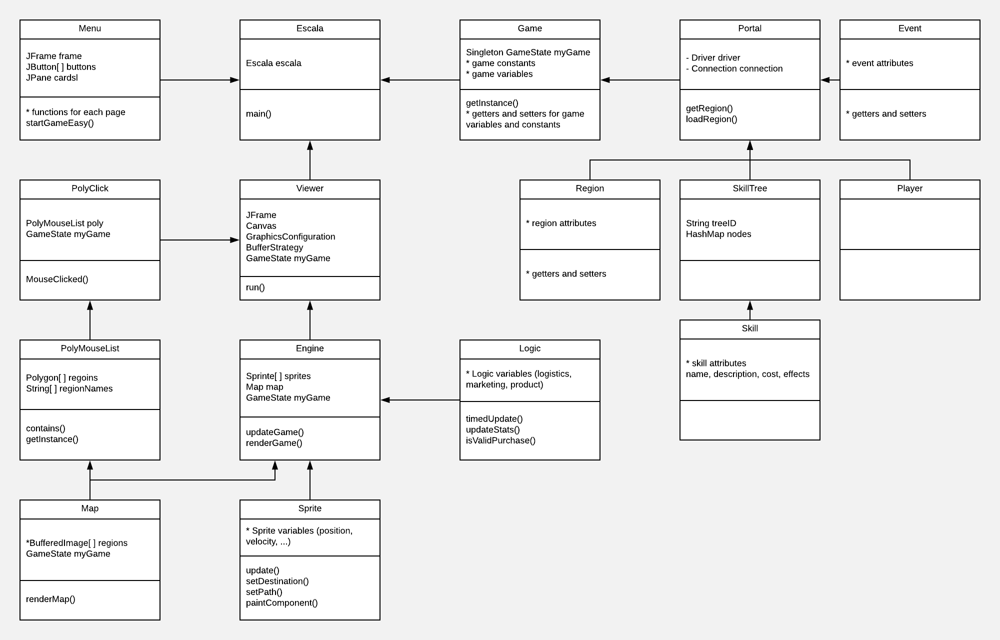

vision statement  
----------------  
Escala is a simulation game that gives players the opportunity to spread a fictional commercial product around the world. This software features educational aspects but is primarily targeted at gamers. Many of the world’s cultural, social, logistical, and economic complexities are baked into the simulation engine, which means this game offers insight into the systems of product diffusion and economies-of-scale that many people take for granted.  

Escala is inspired by [Plague Inc.](https://www.ndemiccreations.com/en/22-plague-inc), a mobile application whose primary objective is to enable players to destroy humanity with a biblical pandemic... Unlike Plague Inc., Escala’s objective is much more benign and *civilization-friendly*.

user stories  
------------  
| User Stories | Validation | Priority | Story Points |
|:------------:|:----------:|:--------:|:------------:|
| I want to be able to change the resolution of the game. | User sees resolution change. | 5 | 2 |
| I want to be able to change the difficulty of the game. | User has different experience at different difficulties. | 5 | 21 |
| I want to be able to select different products for the the game. | User has different experience with different products. | 5 | 3 |
| I want to be able to pause the game on click or when I open a menu. | Game pauses. | 2 | 2 |
| I want to be able to change the speed of the game. | Game changes speed. | 3 | 3 |
| I want the software to load at the center of my screen. | Game starts at the center of the screen. | 1 | 1 |
| I want to be able to change the settings before starting the game. | Settings menu has effect on game. | 3 | 8 |
| I want the graphics to change when I hover over a region. | Game regions change on color. | 1 | 8 |
| I want to see a demo before playing the game. | User is taught how to play the game prior to starting. | 5 | 21 |
| I want to be able to click on the map, and see the effects of my click. | User see change on click. | 1 | 13 |
| I want the game to continue without having to click a button. | Automatic game progression. | 1 | 3 |
| I want to be able to upgrade my product, marketing and logistics. | User can change company stats. | 1 | 21 |
| I want to see my product being shipped across the globe. | Sprites move across globe. | 5 | 5 |
| I want the game to have some randomness, so I can't play the same game twice. | Randomness occurs throught the game. | 4 | 8 |
| I want to see my stats without having to enter a separate menu. | Stats are displayed on the map. | 1 | 3 |
| I want to be able to change my game settings mid-game. | Settings tweaks take effect. | 5 | 21 |
| I want to be able to name my product, and see it used in the game. | Product name is used throughout the game. | 5 | 5 |
| I want to be able to save my game and reload it. | Game can be reloaded. | 5 | 8 |
| I want each region to have immersive data. | User sees region data in-game. | 5 | 8 |

backlogs  
--------  
[Product Backlog](https://github.com/tgsachse/escala/issues?utf8=%E2%9C%93&q=is%3Aissue+label%3A%22product+backlog%22+)  
[Sprint Backlog](https://github.com/tgsachse/escala/issues?utf8=%E2%9C%93&q=is%3Aissue+label%3A%22sprint+2+backlog%22+)  

requirements
------------
- An on-screen slider can change the resolution.
- Each product has unique charateristics.
- Game has a pause button to pause game.
- Game has a play button to play game.
- Game starts in the middle of the screen.
- Game has a fastforward button to increase speed of the game.
- Each region's status is indicated with graphics.
- Regions can be highlighted and clicked on.
- Regions are highlighted when hovered.
- Statistics are stored and shown on the screen.
- Game has graphs on the bottom of screen to diplay statistics.
- All stats values are an integer from 1 to 100.
- Sprites move along a defined path.
- Events are stored in the database.
- Events can be selected at random.
- Game has a settings page with multiple settings.
- This settings page is accessible from the menu.
- Users can enter a product name.
- This product name is used throughout the game.
- Each region's characteristics are unique.
- Each region has an effect on gameplay.
- Time passes automatically at a steady rate.
- Statistics are automatically updated as time passes.
- Users can buy goods with in-game cash.

burndown chart  
---------------  


design diagrams  
---------------  
architecture diagram:
  

class diagram:
  
[larger view](https://raw.githubusercontent.com/tgsachse/escala/master/docs/sprints/sprint2/CLASS_DIAGRAM.png)  

demonstration  
-------------
An early demonstration video is available [here](https://www.youtube.com/watch?v=5SXeTfJ3AfM).

tests  
-----
Manual (plain text) tests are located [here](https://github.com/tgsachse/escala/blob/master/tests/MANUAL_TESTS.md). To run database unit tests, clone the repository and execute the test command like this:
```
git clone https://www.github.com/tgsachse/escala.git
cd escala
./operations.sh --test
```

code  
----  
This game requires [Java8](http://www.oracle.com/technetwork/java/javase/downloads/index.html). Download the zip [here](https://github.com/tgsachse/escala/releases/download/v0.2/escala.zip) and unzip the contents. To the run game, double click `run.sh` on Linux and macOS or `run.bat` on Windows. The scripts can also be executed from the command line.
